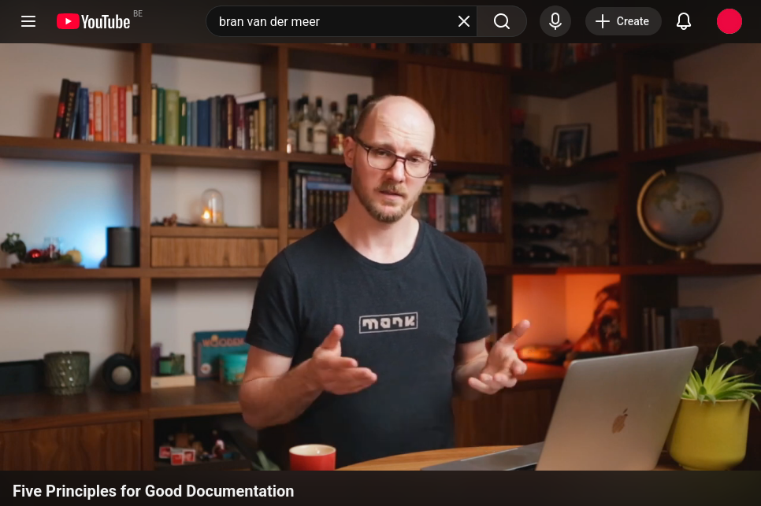

# Bran van der Meer

## Five Principles for Good Documentation

[][ss1]

[ss1]: https://www.youtube.com/watch?v=H0GKczmzYzI

## Five principles

1. relevant
2. timeless
3. tested
4. centralised, accessible
5. collaborative

## Sections needed

- overview
- domain
- architecture  
   example of hpc architecture i.e. building blocks
    - <https://neysa.ai/blog/hpc-architecture/>
    - <https://hpc101.readthedocs.io/en/latest/tutorial/session1/arch.html>
- getting started
- code conventions
    - rules, design patterns, naming
    - why are they so
    - not the things you can automate with linter and pre-commit
- key dependencies (if needed)
- faq / troubleshooting  
  build as faq's become clear not by thinking what would be a potential faq

## Five common problems

1. hard to understand
2. incomplete or non existent
3. out of date
4. overly specific
5. solving the wrong problem

---

Colophon

To make a link on an image in markdown use the syntax as suugested by  
<https://meta.stackexchange.com/questions/38915/creating-an-image-link-in-markdown-format>
