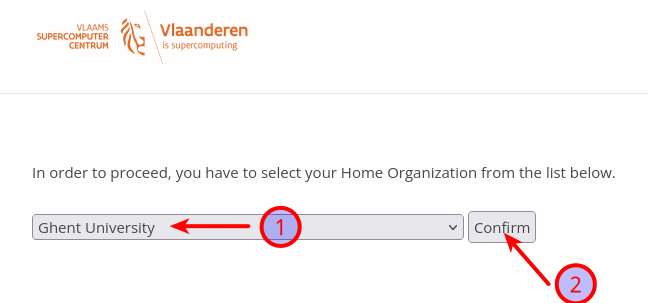
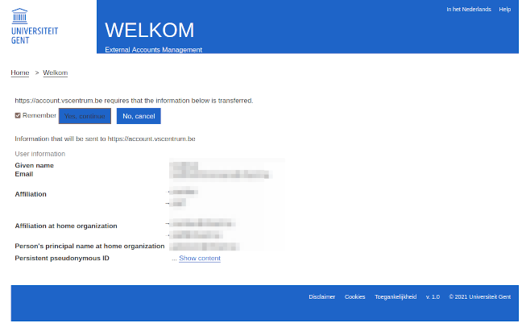
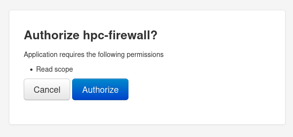
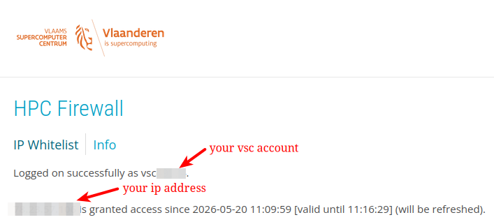
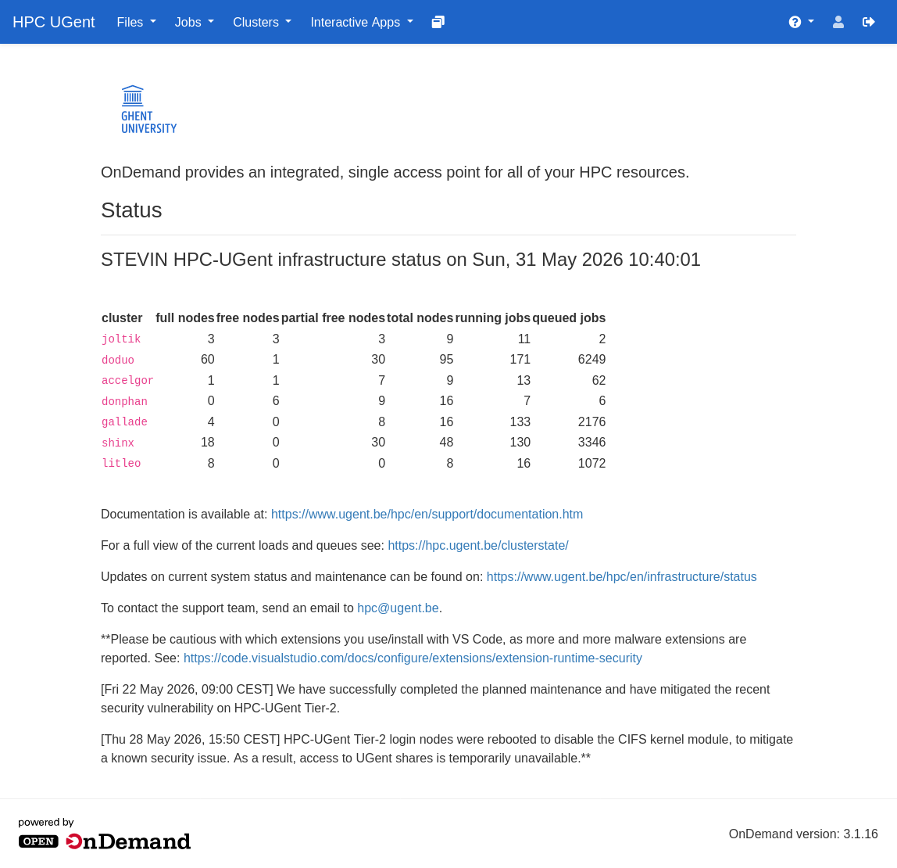

# Step-by-step guide to using the Whisper transcription on the HPC

Below is a step-by-step guide to using Whisper transcription on the HPC.

Please do not hesitate to send any queries regarding this to
<mailto:hpc@ugent.be> (this address is monitored by several of us)

## Connecting

1. In a web browser, navigate to <https://login.hpc.ugent.be>
    - Initially this will show you

    ```text
    You need to connect to the firewall app in new tab and wait up to 30s.

    Keep the tab open while you are connected.
    ```

    - Connect to the VSC firewall at <https://firewall.hpc.kuleuven.be/>

2. Select “Ghent University” and then log in using your Ghent University
    account details (in the background, this will be linked to your vsc12345[^1]
    HPC account)


    

    You will see a consent screen if you did not connect to VSC before.

    

    Select the “Yes, continue” button.

    

    Approve the use of the hpc-firewall, select “Authorise”.

    Information on your connection to the HPC firewall will be shown.

    

    Important: leave this tab open in your browser.

    Open <https://login.hpc.ugent.be> again **in another tab**.

    FIXME: another confirmation is needed? confirm, add screenshot

3. You should now see a website with a blue HPC-UGent menu bar at the top.

    { data-title="This the caption for the HPC dashboard image" }

    ## Uploading files

4. In the blue bar, click on “Files” and then $VSC_DATA
   FIX: add screenshot
5. If necessary, create a new folder here (using the “New Directory” option at
    the top)
6. You can easily upload a file from File Explorer to the website using
    drag-and-drop:
    - Simply drag the file onto the HPC web browser page
    - Click the green ‘Upload 1 file’ button.
      Fix: add screenshot

    ## Starting Whisper

7. In the blue bar at the top,
    - click on ‘Interactive Apps’ and
    - then ‘Transcribe’ (bottom menu option)
    Fix: add screenshot
8. Select the input file you uploaded in steps 4–6:
    - Click the ‘Select Path’ button
    - In the favourites on the left, select the folder ‘/data/gent/123/vsc12345’
      [^1]
    - If necessary, navigate in the right-hand column to the separate folder you
      created in step 5
      FIX: add link as described in https://stackoverflow.com/questions/2822089/how-to-link-to-part-of-the-same-document-in-markdown?noredirect=1&lq=1
    - Highlight the file you uploaded in blue
    - Then click on “Select Path” at the bottom
9. Select “Dutch” as the “Whisper language” (or another language if the
    conversation was not conducted in Dutch)
10. Select the “Show advanced options” button
     - Set “Translation target languages” to “Dutch”
     - Under “Advanced Whisper Flavour”, select “WhisperX”
     - Select the “WhisperX speaker diarisation” button
     - Further down, under “Time (hours)”, select ‘6 hours (1/4 day)’
11. Click on “Launch” at the very bottom
     - Your transcription with diarisation will now start.
     - You will receive emails when the calculations begin and when they are
       complete.

    ## Viewing the transcription with [diarisation]

   [diarisation]: https://en.wikipedia.org/wiki/Speaker_diarisation

12. The final email contains a link that takes you directly to the files (under
     “Result”)
     - The .txt file contains the text with \[SPEAKER_00,01,02,...\] labels
     - The .vtt file also contains time codes

---

## Colophon

- this page is based on an OTRS ticket on this topic, compare to
  https://docs.hpc.ugent.be/transcribe/
- the screenshots can be shown in a lightbox overlay, available as an zensical extension
    - see the zensical.toml of this site
    - see also https://www.nngroup.com/articles/overuse-of-overlays/
- to continue the numbering of a list in markdown see
  <https://stackoverflow.com/a/18089124/906489>
  You need to indent with 4 spaces.

 [^1]: Your vsc account will have other numbers, please adjust.
