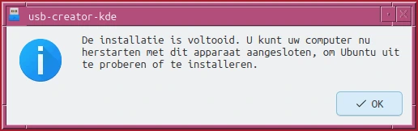

# Installing Linux

For this tutorial we work with Ubuntu.


1. Download the iso-image from
   [Ubuntu 26.04.1 LTS aka Resolute Raccoon](https://ubuntu.com/download/desktop#how-to-install-ResoluteRaccoon)
1. Verify the download
   See https://ubuntu.com/download/desktop/thank-you?version=26.04.1&architecture=amd64&lts=true
   Run this command in your terminal in the directory the iso was downloaded to verify the SHA256 checksum:

   ```bash
   echo "601e30fbf5d97759367c632e2c33630665039b7e2158fd068403da3ccf1bda1f *ubuntu-26.04.1-desktop-amd64.iso" \
     | shasum -a 256 --check
   ```

   You should get the following output:

   ubuntu-26.04.1-desktop-amd64.iso: OK

1. Put the image on a usb-stick (you need X GB)
   [Using Startup Disk Creator](
https://ubuntu.com/desktop/docs/en/latest/how-to/create-a-bootable-usb-stick/#using-startup-disk-creator)

   After a while you'll get:
   

1. Boot your pc with the usb to verify
   1. the usb stick works correctly
   1. you pc can boot an usb
      if this is not the case adjust the bios settings
      legacy might help
      disable or put the secure boot in audit mode

1. if the usb can boot your pc proceed to the installation
   1. wiping the complete disk before is recommended
   1. install with use of the whole disk
   1. select zfs encrypted (altough it is marked experimental) with a password

!!! note 
You'll need a password for your encrypted disk.
Use a really good password (see X TODO)

!!! note
You'll need a user name and a password for the user

!!! note 
This username can be anything, there is no need to use something referring to you

!!! note 
The user password must be different from the disk encryption
