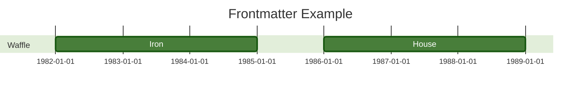
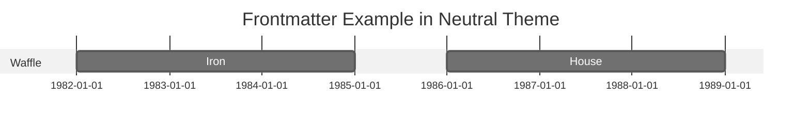
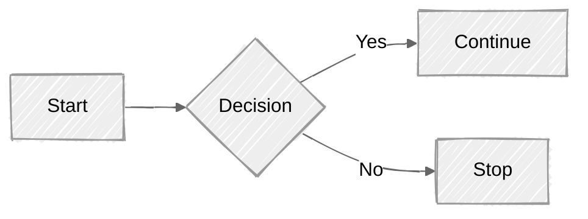
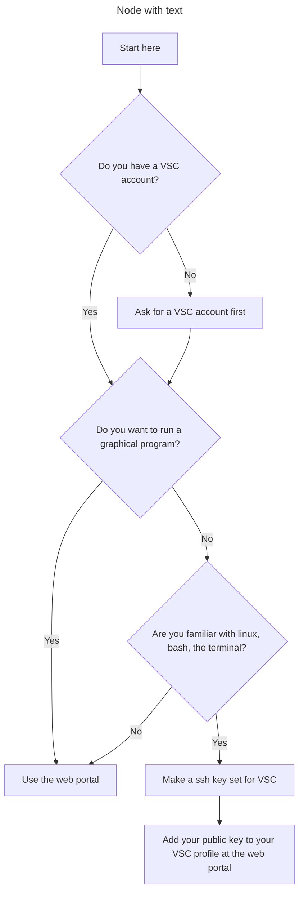
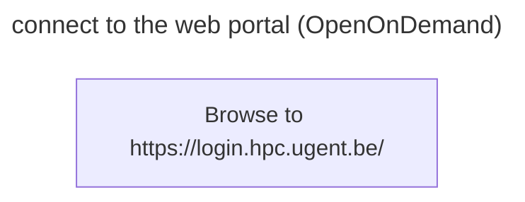

# A mermaid chart

```mermaid
---
title: Frontmatter Example
displayMode: compact
config:
  theme: forest
gantt:
    useWidth: 400
    compact: true
---

gantt
    section Waffle
        Iron  : 1982, 3y
        House : 1986, 3y
```

///caption
And a fig caption
///

```mermaid
---
title: Frontmatter Example in Neutral Theme
displayMode: compact
config:
  look: handDrawn
  theme: neutral
gantt:
    useWidth: 800
    compact: false
---

gantt
    section Waffle
        Iron  : 1982, 3y
        House : 1986, 3y
```

///caption
And a fig caption
///

---

## A hand drawn example

```mermaid
---
config:
  look: handDrawn
  theme: neutral
---
flowchart LR
  A[Start] --> B{Decision}
  B -->|Yes| C[Continue]
  B -->|No| D[Stop]
```

## Another test

```mermaid
---
title: Node with text
---
graph TD
    A[Start here] --> B{Do you have a VSC account?}
    B -->|Yes| C{Do you want to run a graphical program?}
    B -->|No| D[Ask for a VSC account first]
    D[Ask for a VSC account first] --> C{Do you want to run a graphical program?}
    C -->|Yes| E[Use the web portal]
    C -->|No| F{Are you familiar with linux, bash, the terminal?}
    F -->|No| E[Use the web portal]
    F -->|Yes| G[Make a ssh key set for VSC]
    G[Make a ssh key set for VSC] --> H[Add your public key to your VSC profile at the web portal]

```

```mermaid
---
title: connect to the web portal (OpenOnDemand)
---
graph TD
    A[Browse to https://login.hpc.ugent.be/]
```

