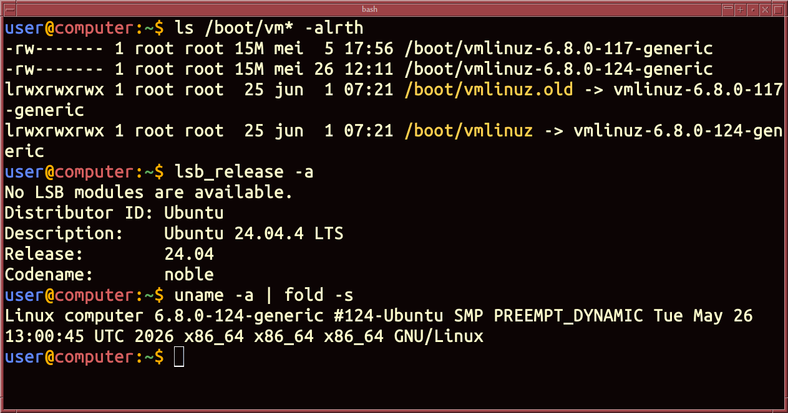

# The terminal

The **terminal** window allows the user access to a text-only terminal and all
its applications such as **command-line interface** (CLI) and **text user
interface** (TUI) applications.

Most people recognise a terminal windows as a black window with only text
characters.



/// caption
A terminal window
///

In the terminal you are using a **[shell](shell.md)** program, such as
**[bash](bash.md)**.


## Linux

Open your terminal app.
On most distributions, press 
++ctrl+alt+t++ 
or search for “Terminal” in your
application menu. A window will appear with a blinking cursor.
This is your terminal, where you type commands.

## macOS

Press 
++cmd+space++ 
to open Spotlight Search, type Terminal, and press Enter.

## Windows

PowerShell is Windows’ built-in terminal for typing commands.
It comes pre-installed on every Windows computer.
Press ++win+x++ and select
Windows PowerShell (or Terminal) from the menu.
A window with a blinking cursor will appear.
This is where you’ll type commands.

Windows has two command-line programs: PowerShell and CMD. They look similar but
use different commands.

How to tell which one you’re in:

PowerShell:

```Powershell
# shows a prompt with the letters PS at the start of each line
PS C:\Users\YourName> 
```

CMD:

```bash 
REM: shows a prompt without the letters PS
C:\Users\YourName>
```

*[TUI]: text user interface

*[GUI]: graphical user interface

*[CLI]: command-line interface

*[PS]: PowerShell
