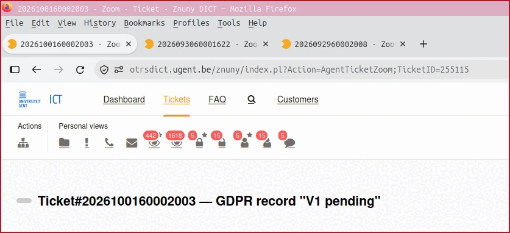
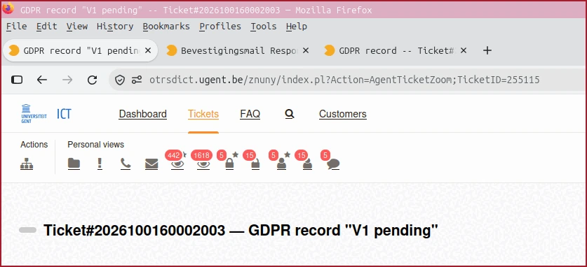

# Useful OTRS / Znuny ticket titles

The title tag (in html) of an OTRS or Znuny ticket looks like this:

```text
2026092960002008 - Zoom - Ticket - Znuny DICT
```

This is not very userfriendly. See also following screenshot:



We can change that to 

```text
GDPR record -- Ticket#2026092960002008
```

When you have multiple tickets open it shows how usefull this is, see 
screenshot:



## How can you do this

The real title of the ticket is available in the first H1 html tag in the html document.

With some javascript we can pick the content of that H1 and modify the title tag of the html document.

An easy way to do this, is by using the add-on Tampermonkey

You can get that add-on from <https://www.tampermonkey.net/> or from the location where you prefer to get your add-ons from.

If Tampermonkey is installed give it following script:

```javascript
// ==UserScript==
// @name         Change title of otrs ticket to real title
// @namespace    http://tampermonkey.net/
// @version      2024-02-03
// @description  try to take over the world!
// @author       You
// @match        https://otrsdict.ugent.be/otrs/*
// @match        https://otrsdict.ugent.be/znuny/*
// @icon         https://www.google.com/s2/favicons?sz=64&domain=ugent.be
// @grant        none
// ==/UserScript==


(function() {
    'use strict';

    // https://stackoverflow.com/questions/76791476/how-to-change-the-title-with-userscripts
    // https://stackoverflow.com/a/18133026/906489
    let title = document.title,
	   newtitle = document.querySelector('h1'),
       newtitletext = newtitle.innerText;
	document.title = newtitletext.split(' — ').reverse().join(' -- ');

})();
```
